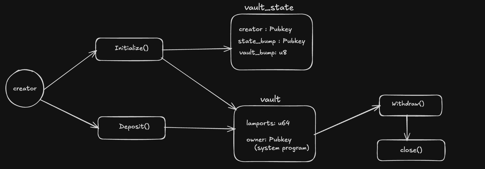
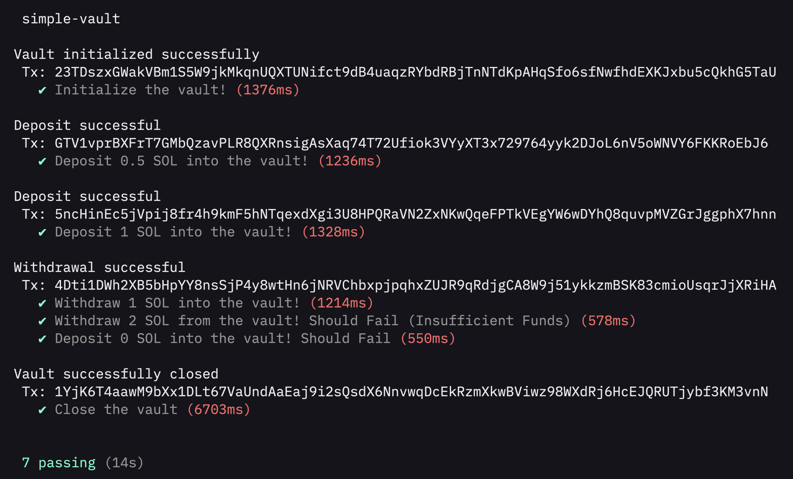

# Simple Vault Program

A simple on-chain Vault Program built with the Anchor framework.It allows users to deposit, withdraw, and manage SOL using Program Derived Addresses (PDAs), ensuring only the vault creator can access the funds.

## Overview

The Vault program lets users safely store **SOL** on-chain.

- Each user gets their own vault  
- The vault is controlled by the program using PDAs  
- Users can deposit, withdraw, and close their vault at any time  
- Rent is handled automatically, and remaining SOL is returned when the vault is closed

## Architecture
The Vault program uses **Program Derived Addresses (PDAs)** to manage vaults securely.  
Each user has two PDAs associated with their vault.

### 1. Vault State PDA

**Purpose:** Stores vault metadata and configuration

- Seed: `["vault_state", creator_pubkey]`

#### 2. Vault PDA

**Purpose:** Holds the actual SOL tokens

- Seed: `["vault", creator_pubkey, vault_state_pubkey]`
- Type: SystemAccount

## Instructions
### 1. Initialize Vault

**Purpose:** Set up a new vault for the user

- Creates `vault_state` PDA with vault metadata
- Creates `vault` PDA for SOL
- Transfers rent-exempt amount to vault
- Stores creator pubkey and PDA bump values

### 2. Deposit

**Purpose:** Add SOL to the vault

**Parameters:**
- `amount: u64` - Amount in lamports (1 SOL = 1,000,000,000 lamports)

- Validates deposit amount (must be > 0)
- Transfers SOL from signer to vault via CPI
- Updates vault balance

**Fee Structure:**
- Transaction fee: ~5,000 lamports

### 3. Withdraw

**Purpose:** Remove SOL from the vault

**Parameters:**
- `amount: u64` - Amount in lamports to withdraw

- Validates withdrawal amount and authorization
- Uses Vault PDA signer seeds to authorize transfer
- Transfers SOL from vault back to creator via CPI
- Updates vault balance

**Validations:**
- Signer is vault creator
- Vault has sufficient balance
- Amount is valid and non-zero
- PDA signature verification succeeds

### 4. Close

**Purpose:** Close the vault and recover rent-exempt reserves

- Transfers all remaining SOL from vault to creator
- Closes vault_state account and returns rent
- Closes vault account (via SystemProgram)
- Returns all recovered lamports to creator

## Error Handling

The Vault program includes custom error handling to ensure safe and correct execution.

- Unauthorized  
  Occurs when a non-creator tries to withdraw funds or close the vault.

- InsufficientFunds  
  Occurs when attempting to withdraw more SOL than the vault balance.

- InvalidAmount  
  Occurs when trying to deposit or withdraw an invalid amount such as 0 SOL.

## Testing

- Initialize the vault!
- Deposit 0.5 SOL into the vault!
- Deposit 1 SOL into the vault!
- Withdraw 1 SOL from the vault!
- Withdraw 2 SOL from the vault! (Should Fail)
- Deposit 0 SOL into the vault! (Should Fail)
- Close the vault

### Devnet Information

- **Program ID:** `CmKVpLqQ7C5kGpWuQ6EiivXsEprdgfhk96rDtj4daavr`
- **Network:** Devnet

## Example Transactions (Devnet)

### Initialize Vault

[View Initialize Transaction](https://orbmarkets.io/tx/23TDszxGWakVBm1S5W9jkMkqnUQXTUNifct9dB4uaqzRYbdRBjTnNTdKpAHqSfo6sfNwfhdEXKJxbu5cQkhG5TaU?cluster=devnet
)

### Deposit SOL

[View Deposit Transaction](https://orbmarkets.io/tx/5ncHinEc5jVpij8fr4h9kmF5hNTqexdXgi3U8HPQRaVN2ZxNKwQqeFPTkVEgYW6wDYhQ8quvpMVZGrJggphX7hnn?cluster=devnet
)

### Withdraw SOL

[View Withdraw Transaction](https://orbmarkets.io/tx/4Dti1DWh2XB5bHpYY8nsSjP4y8wtHn6jNRVChbxpjpqhxZUJR9qRdjgCA8W9j51ykkzmBSK83cmioUsqrJjXRiHA?cluster=devnet
)

### Close Vault

[View Close Transaction](https://orbmarkets.io/tx/1YjK6T4aawM9bXx1DLt67VaUndAaEaj9i2sQsdX6NnvwqDcEkRzmXkwBViwz98WXdRj6HcEJQRUTjybf3KM3vnN?cluster=devnet)

## Summary

- Implemented a simple on-chain vault program using the Anchor framework  
- Used Program Derived Addresses (PDAs)
- Enabled users to initialize, deposit, withdraw, and close their vaults  
- Tested all instructions, including failure cases, using Anchor tests  
- Successfully deployed and verified the program on Solana Devnet
